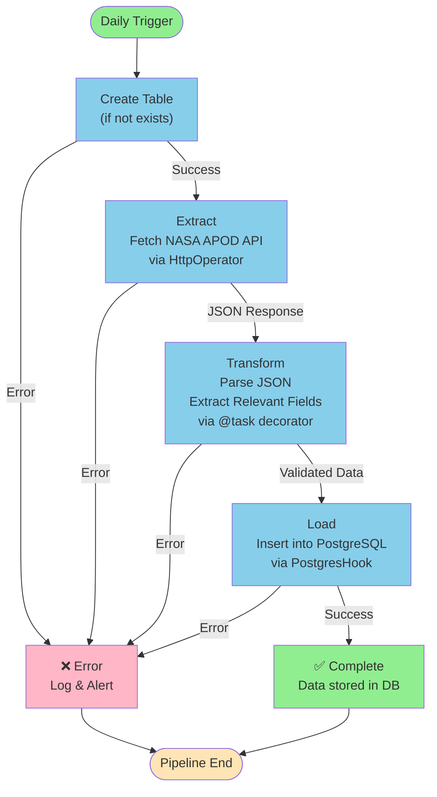
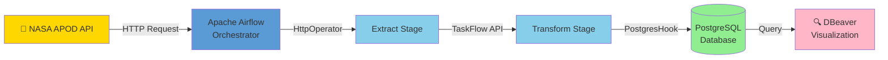

# 🚀 Airflow ETL Pipeline: NASA APOD Data Integration

A complete **Extract-Transform-Load (ETL)** pipeline that fetches NASA's Astronomy Picture of the Day data, processes it, and stores it in PostgreSQL using Apache Airflow orchestration.

---

## 🎯 Overview

This project demonstrates a production-ready ETL workflow using:
- **Apache Airflow** - Orchestration & scheduling
- **PostgresSQL** - Data storage
- **NASA APOD API** - Data source (Get the api here https://api.nasa.gov/#browseAPI)
- **Docker** - Containerized environment
- **DBeaver** - Database visualization

---

## 📦 Tech Stack

| Component | Purpose |
|-----------|---------|
| **Airflow** | Workflow orchestration & task scheduling |
| **PostgreSQL** | Data warehouse |
| **Docker** | Runtime environment isolation |
| **HttpOperator** | API data extraction |
| **PostgresHook** | Database connectivity |

---

## 🔄 ETL Pipeline Flow

### 1️⃣ **Extract**
- Calls NASA APOD API via `HttpOperator`
- Fetches daily astronomy data in JSON format
- Captures: title, explanation, URL, date, media type

### 2️⃣ **Transform**
- Processes JSON response using TaskFlow API (`@task` decorator)
- Extracts relevant fields
- Ensures data format compatibility with database schema

### 3️⃣ **Load**
- Inserts transformed data into PostgreSQL
- Auto-creates `apod_data` table if it doesn't exist
- Uses `PostgresHook` for secure database operations

---

## 📋 Database Schema

```sql
CREATE TABLE apod_data (
    id SERIAL PRIMARY KEY,
    title VARCHAR(255),
    explanation TEXT,
    url TEXT,
    date DATE,
    media_type VARCHAR(50)
);
```

---

## 🏗️ Architecture



---

## 🚦 Getting Started

### 1. Start Airflow
```bash
astro dev start
```

### 2. Create Connections in Airflow UI
- Navigate to **Admin > Connections**
- Add `nasa_api` (HTTP connection)
- Add `my_postgres_connection` (PostgreSQL connection)

### 3. Monitor & Trigger DAG
- Access Airflow UI at `http://localhost:8080`
- Find `nasa_apod_postgres` DAG
- Trigger and monitor execution

### 4. View Results in DBEaver
- Connect to PostgreSQL database
- Query the `apod_data` table
- Analyze extracted astronomy data

---

## ✨ Key Features

✅ **Automated daily data extraction**  
✅ **Error handling & retry logic**  
✅ **Task dependency management**  
✅ **Data validation & transformation**  
✅ **Scalable & containerized architecture**  

---

## 📁 Project Structure

```
nasa_api_project/
├── dags/
│   └── etl.py              # Main DAG definition
├── Dockerfile              # Container configuration
├── requirements.txt        # Python dependencies
├── docker-compose.yml      # Service orchestration
└── airflow_settings.yaml   # Airflow configuration
```

---

## 🔧 Dependencies

- `apache-airflow`
- `apache-airflow-providers-http`
- `apache-airflow-providers-postgres`
- `psycopg2-binary`

---

## 📊 Component Interaction



---

## 🛠️ Troubleshooting

**Connection types missing?**
- Ensure provider packages are in `requirements.txt`
- Run `astro dev stop && astro dev start`

**Database connection errors?**
- Verify PostgreSQL connection credentials in Airflow UI
- Check Docker container status with `docker ps`

---

## 📚 Resources

- [Apache Airflow Documentation](https://airflow.apache.org/docs/)
- [Airflow HTTP Provider](https://airflow.apache.org/docs/apache-airflow-providers-http/stable/)
- [Airflow PostgreSQL Provider](https://airflow.apache.org/docs/apache-airflow-providers-postgres/stable/)
- [NASA APOD API](https://api.nasa.gov/)
- [Astronomer CLI Docs](https://docs.astronomer.io/)

---

**Happy Data Pipelining! 🎉**
